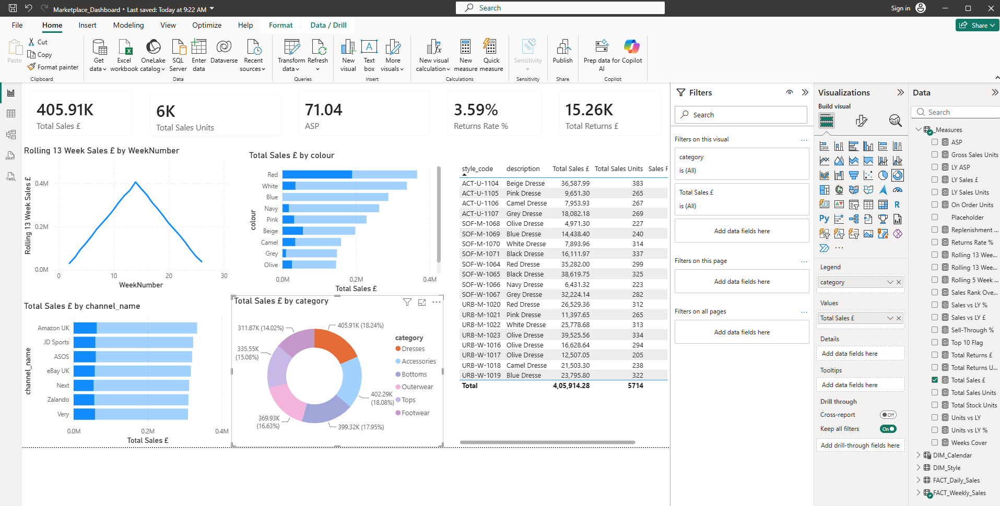
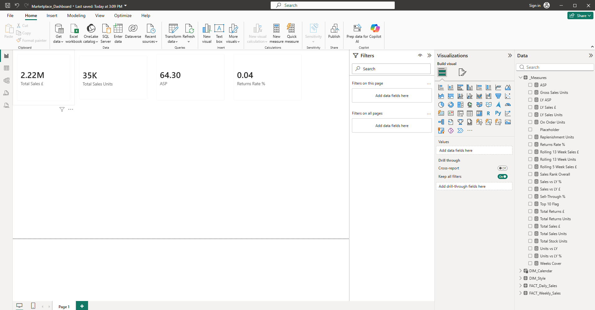
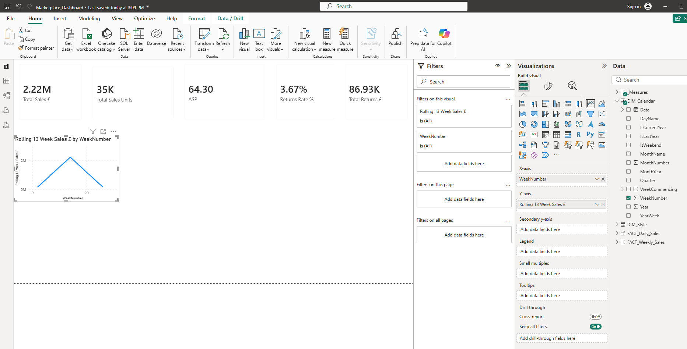
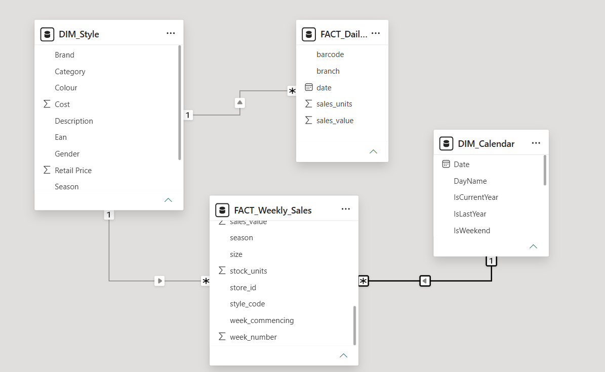
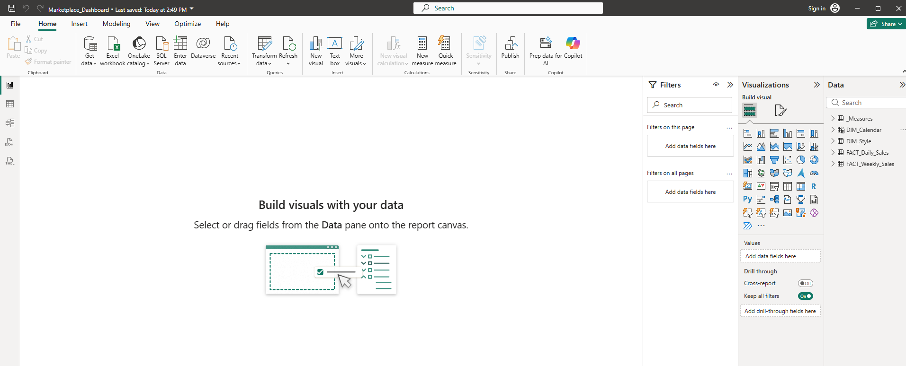
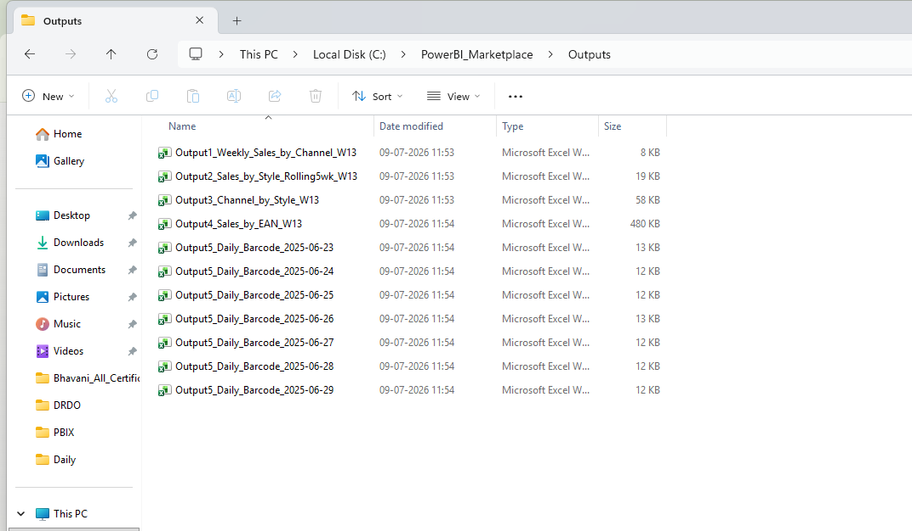

# 🛍️ Marketplace Sales Reporting — Power BI Dashboard & Automated Pipeline

> **UK Fashion Retailer** | Marketplace Integrator Migration Project  
> Built from scratch using Power BI Desktop, Python, and Windows Task Scheduler  
> **Go-Live: 29 July 2026**

---

## 📌 Project Overview

A UK fashion retailer migrating to a new marketplace integrator needed their entire sales reporting rebuilt from scratch. The external reporting provider stops on migration day — this project replaces it with an internal Power BI dashboard and automated Python spreadsheet pipeline.

| Detail | Value |
|--------|-------|
| **Channels** | Amazon UK, ASOS, Next, Zalando, eBay UK, Very, JD Sports |
| **Brands** | UrbanEdge, SoftLux, ActivePeak |
| **Dashboard** | Power BI Pro — 3 brand versions |
| **Spreadsheet Outputs** | 5 automated reports (weekly + daily) |
| **Data Source** | CSV/XLSX exports from new integrator |

---

## 📊 Dashboard Preview

### Full Dashboard


### KPI Cards Row


### 13-Week Rolling Sales Chart


### Sales by Channel


---

## 🗄️ Data Model

### Star Schema — 4 Tables, 3 Relationships


| Table | Type | Rows | Description |
|-------|------|------|-------------|
| `FACT_Weekly_Sales` | Fact | 7,715 | Weekly sales exports per channel/style |
| `FACT_Daily_Sales` | Fact | 1,975 | Daily barcode-level transactions |
| `DIM_Style` | Dimension | 720 | Style catalogue with EAN, cost, retail price |
| `DIM_Calendar` | Dimension | Auto | Date table with week, month, quarter columns |

### Relationships
```
DIM_Calendar[Date]       ──1────*──  FACT_Weekly_Sales[week_commencing]
DIM_Style[StyleCode]     ──1────*──  FACT_Weekly_Sales[style_code]
DIM_Style[Ean]           ──1────*──  FACT_Daily_Sales[barcode]
```

---

## 📐 DAX Measures (25 Total)

### Group 1 — Core KPIs
```dax
Total Sales £ = SUM(FACT_Weekly_Sales[sales_value])
Total Sales Units = SUM(FACT_Weekly_Sales[sales_units])
ASP = DIVIDE([Total Sales £], [Total Sales Units], 0)
Returns Rate % = DIVIDE([Total Returns Units], [Gross Sales Units], 0)
Sell-Through % = DIVIDE([Total Sales Units], [Total Sales Units] + [Total Stock Units], 0)
```

### Group 2 — Last Year Comparisons
```dax
LY Sales £ = CALCULATE([Total Sales £], SAMEPERIODLASTYEAR(DIM_Calendar[Date]))
Sales vs LY £ = [Total Sales £] - [LY Sales £]
Sales vs LY % = DIVIDE([Sales vs LY £], [LY Sales £], 0)
```

### Group 3 — Rolling Trackers
```dax
Rolling 13 Week Sales £ = CALCULATE([Total Sales £],
    DATESINPERIOD(DIM_Calendar[Date], LASTDATE(DIM_Calendar[Date]), -91, DAY))

Rolling 5 Week Sales £ = CALCULATE([Total Sales £],
    DATESINPERIOD(DIM_Calendar[Date], LASTDATE(DIM_Calendar[Date]), -35, DAY))
```

### Group 4 — Stock & Replenishment
```dax
Weeks Cover = DIVIDE([Total Stock Units], DIVIDE([Total Sales Units], 5, 0), 0)
On Order Units = SUM(FACT_Weekly_Sales[on_order_units])
```

### Group 5 — Best Sellers Rankings
```dax
Sales Rank Overall = RANKX(ALL(FACT_Weekly_Sales[style_code]), [Total Sales £],, DESC, DENSE)
Top 10 Flag = IF([Sales Rank Overall] <= 10, "Top 10", "Other")
```

---

## 📂 Folder Structure

```
C:\PowerBI_Marketplace\
    Data\
        Weekly\          ← Weekly CSV/XLSX exports
        Daily\           ← Daily barcode files
        LY_Data\         ← Last Year data
    Reports\
        UrbanEdge\
        SoftLux\
        ActivePeak\
    Outputs\             ← All 5 automated reports
    PBIX\                ← Marketplace_Dashboard.pbix
    generate_reports.py  ← Main automation script
```


---

## 📋 Power BI Tables Loaded



---

## 🤖 Automated Spreadsheet Outputs

### 5 Reports Generated by Python Script

| # | Report | Delivery | Contents |
|---|--------|----------|----------|
| 1 | Weekly Sales by Channel | Monday 6am | Sales £ & units by channel per week |
| 2 | Sales by Style — Rolling 5wk | Monday 6am | Style-level view per brand |
| 3 | Channel-Specific by Style | Monday 6am | Style report per channel |
| 4 | Sales by EAN | Monday 6am | Barcode-level sales & returns |
| 5 | Daily Sales by Barcode | Daily 5:30am | Branch, date, barcode, value, units |

### Output Files Generated


---

## 🚀 How to Run

### Prerequisites
```bash
pip install pandas openpyxl
```

### Run the Report Generator
```bash
cd C:\PowerBI_Marketplace
Python generate_reports.py
```

### Schedule Automatically (Windows Task Scheduler)
```
Weekly Reports:  Every Monday at 06:00 AM
Daily Barcode:   Every day at 05:30 AM
```

---

## 📁 Repository Structure

```
marketplace-powerbi-reporting/
│
├── screenshots/
│   ├── 01_dashboard_overview.png
│   ├── 02_data_model_relationships.png
│   ├── 03_tables_loaded.png
│   ├── 04_kpi_cards.png
│   ├── 05_channel_bar_chart.png
│   ├── 06_rolling_chart.png
│   ├── 07_output_files.png
│   └── 08_folder_structure.png
│
├── scripts/
│   └── generate_reports.py       ← Main automation script
│
├── sample_data/
│   ├── weekly_sales_export.csv   ← Sample weekly data (7,715 rows)
│   └── daily_sales_barcode.csv   ← Sample daily data (1,975 rows)
│
├── docs/
│   └── Marketplace_Handover_Guide.docx
│
└── README.md
```

---

## 🛠️ Tech Stack

| Tool | Purpose |
|------|---------|
| Power BI Desktop | Dashboard & data model |
| DAX | Calculations & KPI measures |
| Python 3 | Automated report generation |
| pandas | Data manipulation |
| openpyxl | Excel file creation |
| Windows Task Scheduler | Automated scheduling |

---

## 📧 Report Recipients

| Report | Recipients |
|--------|-----------|
| Power BI Dashboard | All stakeholders |
| Weekly outputs | Womenswear, Menswear, Ecommerce, Management |
| Daily barcode | Ecommerce leads |

---

## 👩‍💻 Author

**KS Bhavani** — Assistant Professor, Computer Science & Engineering  
Malla Reddy Engineering College for Women, Hyderabad  

[](https://github.com/sivabhavani-max)

---

## 📄 License

This project is for educational and portfolio purposes.
